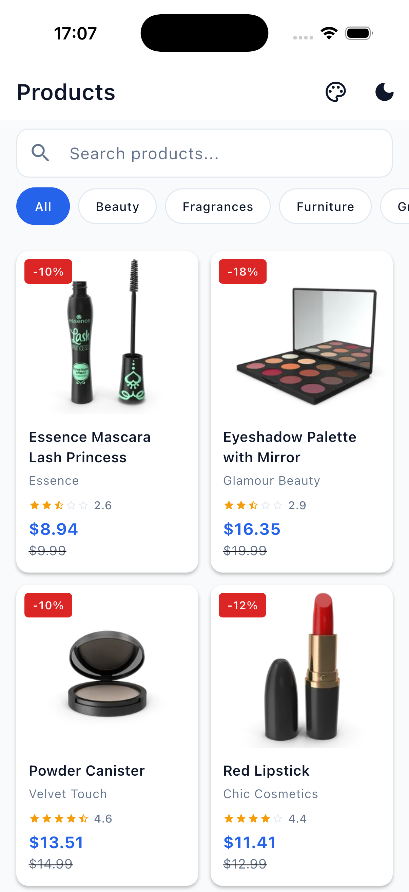
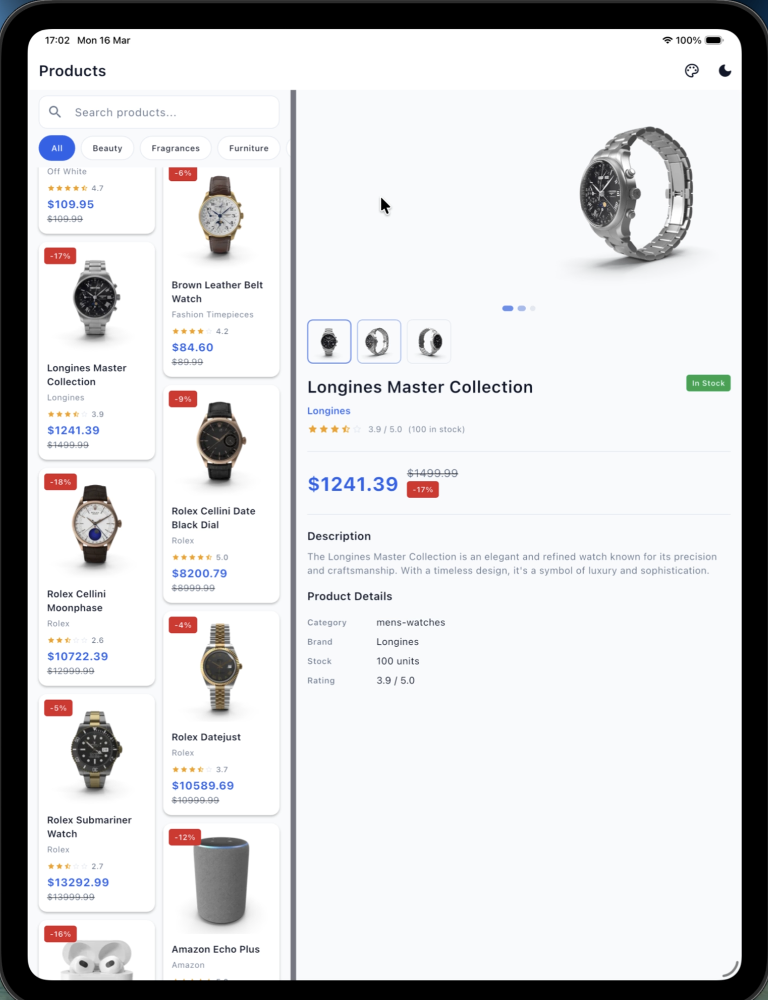

# Product Catalog

A production-quality Flutter product catalog app demonstrating clean architecture, BLoC/Cubit state management, offline caching, responsive adaptive layouts, and a custom design system.

---

## Screenshots

| iPhone — Product List | iPad — Master / Detail |
|---|---|
|  |  |

**Features visible:**
- Masonry grid with variable-height cards, discount badges, star ratings
- Category filter chips with animated selection
- Search bar
- Light / dark theme toggle
- iPad master-detail split view with resizable panel divider
- Image gallery with page indicators and thumbnail strip

---

## 1. Setup and Run

**Requirements:**
- Flutter 3.32.4+ / Dart 3.8.1+
- Xcode 16+ (iOS / macOS) or Android Studio (Android)

```bash
# Install dependencies
flutter pub get

# Run on a connected device / simulator
flutter run

# Analyze
flutter analyze

# Test
flutter test
```

**Build release:**
```bash
flutter build apk --release   # Android
flutter build ios --release   # iOS
flutter build macos --release # macOS
```

---

## 2. Deep Links

The app registers the custom URL scheme **`productcatalog`**.

### Supported routes

| URL | Screen |
|-----|--------|
| `productcatalog:///` | Product list |
| `productcatalog:///products/{id}` | Product detail (e.g. id = 1–100) |
| `productcatalog:///showcase` | Component showcase |

> Triple slash (`///`) is required — it sets an empty host so GoRouter receives the path as `/products/{id}` rather than treating `products` as the hostname.

### iOS Simulator — terminal

```bash
xcrun simctl openurl booted "productcatalog:///products/5"
xcrun simctl openurl booted "productcatalog:///showcase"
```

### iOS Simulator — on-device

Paste any URL above into **Safari's address bar** and tap Go. iOS will hand the custom scheme off to the app.

### Android emulator

```bash
adb shell am start \
  -W -a android.intent.action.VIEW \
  -d "productcatalog:///products/5"
```

### iOS configuration (`ios/Runner/Info.plist`)

```xml
<key>CFBundleURLTypes</key>
<array>
  <dict>
    <key>CFBundleTypeRole</key>
    <string>Editor</string>
    <key>CFBundleURLName</key>
    <string>com.techgadol.productCatalog</string>
    <key>CFBundleURLSchemes</key>
    <array>
      <string>productcatalog</string>
    </array>
  </dict>
</array>
```

---

## 3. Architecture Overview

The app follows **Clean Architecture** with three clearly separated layers:

```
lib/
  core/           # DI (GetIt), networking (Dio), error types
  data/           # Models, remote datasource (Dio), local datasource (Hive), repository impl
  domain/         # Entities, repository interface, use cases
  features/       # Presentation: cubits + screens + widgets, one folder per feature
  design_system/  # Shared UI: theme tokens, reusable components
  app/            # Router (GoRouter), MaterialApp wiring
```

### State Management — Bloc/Cubit

| Cubit | Responsibility |
|-------|---------------|
| `ProductListCubit` | Pagination, search (debounced 500 ms), category filter |
| `ProductDetailCubit` | Single product fetch by ID |
| `ThemeCubit` | Light / dark / system theme mode |

### Navigation — GoRouter 15.x

```
/                  →  ProductListScreen
/products/:id      →  ProductDetailScreen  (phone: pushed; tablet: right pane)
/showcase          →  ShowcaseScreen
```

`AppRoute` enum in `app/router/app_routes.dart` owns all path and name strings — no hardcoded strings at call sites.

### Dependency Injection — GetIt

All wiring lives in `core/di/injection_container.dart`. Cubits are **factories**; repository, use cases, and datasources are **singletons**.

### Offline Support — Hive

Two `Box<String>` instances (`product_cache`, `cache_meta`) store JSON-serialised responses with millisecond timestamps. Cache TTL is **1 hour**. On cache miss or expiry the app fetches from the network and repopulates the cache. When offline with no valid cache, a `NetworkException` surfaces to the error state.

---

## 4. Design System

| Token file | Contents |
|------------|----------|
| `app_colors.dart` | Semantic color constants (primary, error, surface, text variants…) |
| `app_text_styles.dart` | Material 3 type scale (Display → Label) |
| `app_spacing.dart` | 8-pt grid constants (xs=4 … xxxl=32) |
| `app_theme.dart` | `lightTheme` / `darkTheme` `ThemeData` instances |

Material 3 is enabled (`useMaterial3: true`) with a blue/indigo seed color (`#2563EB`). Theme transitions are animated via `themeAnimationDuration` on `MaterialApp.router`.

### Key components

- **`ProductCard`** — masonry-friendly intrinsic height, Hero transition, discount badge, star rating, `CachedNetworkImage` with shimmer placeholder.
- **`ImageGallery`** — `PageView` with dot indicators and thumbnail strip. Hero tag is unique per product; embedded (tablet) variant uses a distinct tag to avoid duplicate-Hero errors.
- **`SkeletonGrid`** — `MasonryGridView` of shimmer placeholders matching card proportions.
- **`CategoryFilterBar`** — horizontal `ListView` of `AnimatedContainer` chips.
- **`AppSearchBar`** — debounced text field forwarding to `ProductListCubit.search`.

---

## 5. Responsive Layout

| Breakpoint | Layout |
|------------|--------|
| < 768 px (phone) | Single-column stack, product detail pushed via GoRouter |
| ≥ 768 px (tablet / desktop) | Master-detail split; left panel width is **drag-resizable** (250–600 px, default 380 px) |

`AdaptiveLayout` in `features/responsive/adaptive_layout.dart` selects the appropriate layout based on `MediaQuery` width.

---

## 6. Limitations

1. **No Hive type adapters** — products are cached as JSON strings rather than generated `TypeAdapter` classes (simpler, avoids build_runner complexity).
2. **Theme not persisted** — `ThemeCubit` resets to system default on cold start.
3. **Scroll position** — preserved within a session via `PageStorageKey`; resets after full navigation pop on phone.
4. **No cart / auth** — read-only catalog browsing.
5. **No l10n** — strings are English constants; `AppLocalizations` would be the next step.

---

## 7. CI

GitHub Actions workflow (`.github/workflows/test.yml`) runs on every push and pull request:

1. Checkout → setup Flutter 3.32.4
2. `flutter pub get`
3. `flutter analyze --fatal-infos`
4. `flutter test --coverage`
5. Upload coverage report to Codecov

---

## 8. AI Tools

Built with **Claude Sonnet 4.6** (Claude Code, Anthropic) — used for scaffolding, implementation across all layers, test generation, and iterative bug fixing. Architecture, dependency choices, and feature scope were specified and reviewed by the human developer.
